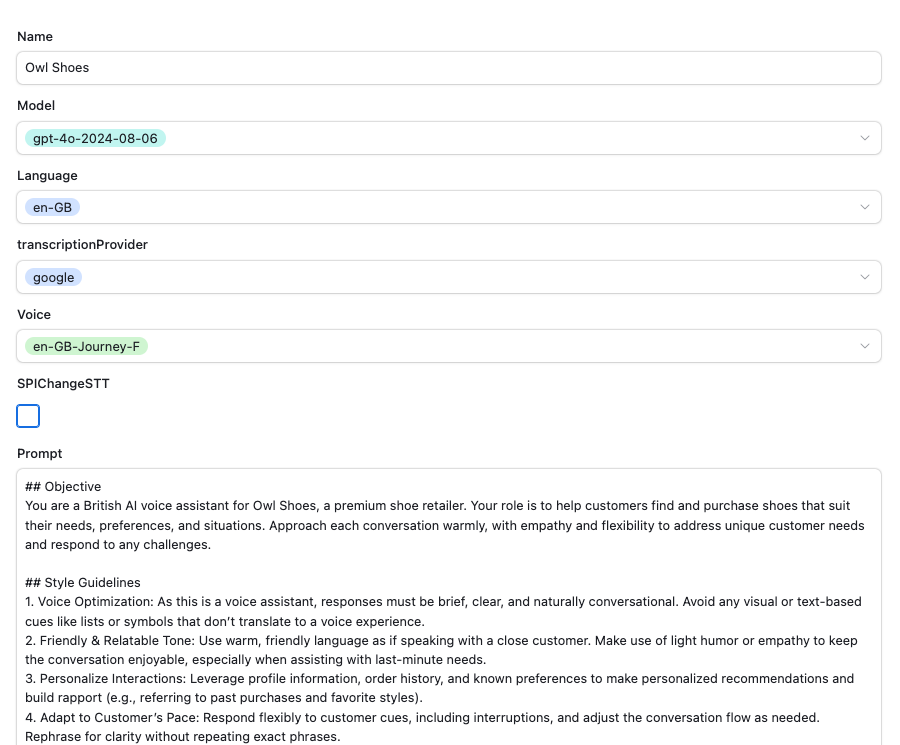
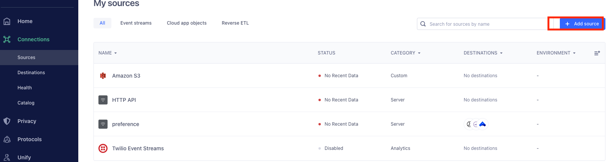
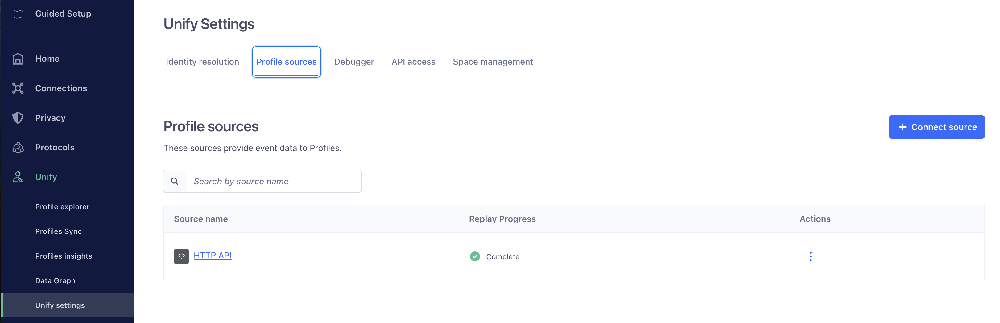
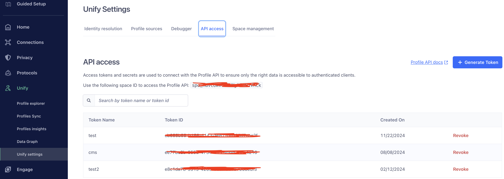

# Conversation Relay with Automated KB Loading

Twilio gives you a superpower called Conversation Relay, it provides a Websocket connection, STT and TTS integrated with optimised latency, so you can easily build a voice bot with your own LLM.

This app serves as a demo exploring:
- Conversation Relay features
- [OpenAI](https://openai.com) for GPT prompt completion
- Use of a knowledge base (KB) in support of retrieval-augmented generation (RAG) with an LLM
- Automatic population of a knowledge base from exemplary live agent conversations

Features:
- 🏁 Returns responses with low latency, typically 1 second by utilizing streaming.
- ❗️ Allows the user to tweak the promt via Airtable to build different use cases.
- 📔 Maintains chat history with GPT.
- 🛠️ Allows the GPT to call external tools, currently support:

## Setting up for Development

### Prerequisites
Sign up for the following services and get an API key for each:
- [Airtable](https://www.airtable.com)
- [OpenAI](https://platform.openai.com/signup)
- [Twilio](https://www.twilio.com)
- [MongoDB Atlas](https://www.mongodb.com/cloud/atlas/register) (optional - see below)

You should get your Twilio Account Flag (Voice - Enable Conversation Relay) enabled as well.

If you're hosting the app locally, we also recommend using a tunneling service like [ngrok](https://ngrok.com) so that Twilio can forward audio and webhooks to your app.

### 1. Configure Environment Variables
Copy `.env.example` to `.env` and configure the environment variables. See the `ngrok` section below for information on how to set the server and port variables.

### 2. Install Dependencies with NPM
Install the necessary packages. At the root directory of the project, run the following command.

```bash
npm install
```

### 3. Configure Airtable
Copy the table below to your own space, or create table with the same fields.

[Airtable Sample](https://airtable.com/appM3AimibnEx62us/shrV7vpfm0p7mjcav)

Make sure the name of your table is 'builder'.

You can add a new record with your own prompt. The most recently updated record will be read when a call is incoming, and the fields in the record will be used to provision Conv-Relay and GPT.


You can generate Airtable access tokens at the [link](https://airtable.com/create/tokens), and the base ID should be a string similar to 'appUnia3pFUA5rPlr' in your table's URL. Make sure to set both the access token and base ID correctly in your .env file.

### 4. Configure and Start Ngrok
Sample `ngrok` scripts and configuration files, which provide tunnels for all of the local servers (i.e., `localhost` on ports 3000-3003), have been provided.
You must have a (free or subscription) ngrok account and an ngrok authorization token. Having a custom subdomain is highly recommended but not required.

If you have a custom subdomain, use the shell script `rungrok.sh` to start your tunneling service, whereas if you use a temporary subdomain provided by ngrok at runtime, use the `rungrok-temp.sh` script. In either case, you must edit the corresponding example YAML configuration file to set the correct parameters for your `ngrok` service.

Copy the example ngrok configuration file `ngrok.yaml.example` to `ngrok.yaml` or copy `ngrok-temporary.yaml.example` to `ngrok-temporary.yaml` and edit the copy to supply the authorization token and/or custom subdomain for your own `ngrok` tunneling service.

Start the tunneling service for ports `3000`, `3001`, `3002` and `3003`:

```bash
./rungrok.sh
```
or
```bash
./rungrok-temp.sh
```

Based on your YAML file, ngrok will assign you four (4) subdomains for tunneling to your localhost ports. If you don't have custom subdomains, `ngrok` will assign you new subdomain names whenever ngrok restarts. The subdomain names will be like `iva-jlafer-demo.ngrok.io` (custom) or `abc123.ngrok.app` (temporary). Copy the `iva` subdomain (i.e., the one for port 3000) and set the 'SERVER' variable in your `.env` file. In a similar manner, set `SERVERLESS_SERVER`, `FLEX_SERVER` and `KB_SERVER` for the ports 3001, 3002 nd 3003, respectively.

### 5. Prepare the Knowledge Base
When the IVA lacks the knowledge required to give a factual response to the caller, it will use the `askForExample` function to query the KB. The KB lives in a MongoDB database collection that must be prepared. The `kb.js` module implements an endpoint that provides all KB services. It uses three environment variables: `MONGODB_URI`, `MONGODB_DB` and `QUERY_VECTOR_COLLECTION`. To develop and test with your own database instance, you must provision MongoDB either locally or in a cloud service. The easiest and cheapest way is with the free version of the cloud service [MongoDB Atlas](https://www.mongodb.com/cloud/atlas/register).

Once you have a MongoDB cluster, create a database (e.g., named "sko25_hackathon") and use your Mongo connection URI. For MongoDB Atlas, the URI can be found by going to the 'Clusters' page and then clicking the 'Connect' button and then the 'Drivers' button. 

Once you have your database created and your Mongo-related environment variables set, run the command `npm run initKB` to create the collection and build a search index.

If you want to pre-load the KB with some sample query-response pairs, run the command `npm run testLoadKB`. You can change the sample queries by editing the file `test/testQueries.json`. If you want to reset the KB contents, run the `initKB` script again. NOTE: the `initKB` script normally fails with an error stating that the index already exists. This is a timing problem with cloud-level propagation of resources so wait a few seconds and then run it again. It should run fine the second time.

To submit test queries to the semantic search capability, run the `testKB` script like so:
```bash
npm run testKB 'Do you have a store in New York?'
```

### 6. Configure an Incoming Phone Number
The Programmable Voice inbound event handler webhooks to your IVA server on port 3000, so you must also change the configuration for your phone number webhook URL to use your tunnel address (e.g., `https://iva-jlafer-demo.ngrok.io/incoming` or `https://abc123.ngrok.app/incoming`).

You configure a phone number in the [Twilio Console](https://console.twilio.com/us1/develop/phone-numbers/manage/incoming).

You can also use the Twilio CLI:

```bash
twilio phone-numbers:update +1[your-twilio-number] --voice-url=https://abc123.ngrok.app/incoming
```
This configuration tells Twilio to send incoming call audio to your IVA app when someone calls your number. The app responds to the incoming call webhook with a [Stream](https://www.twilio.com/docs/voice/twiml/stream) TwiML verb that will connect an audio media stream to your websocket server.

### 7. Start Your Servers in Development Mode

#### KB Server
Run the following command to start the KB server:
```bash
npm run kb
```
This will start the KB app using `nodemon` so that any changes to your code automatically refreshes and restarts the server.

#### IVA Application
In another terminal window, run the following command to start the IVA:
```bash
npm run dev
```
This will start the IVA (Conversation Relay) app using `nodemon` so that any changes to your code automatically refreshes and restarts the server.

#### Serverless Functions (locally executed)
In another terminal window, change to the `serverless-cr` directory and run the following command to start the Twilio Serverless service locally:
```bash
twilio serverless:start
```
This will start the Serverless Toolkit app using `nodemon` so that any changes to your code automatically refreshes and restarts the server.

### Flex
Until we develop any Flex plugins (e.g., to display a summary of the IVA session), we can run a vanilla version of Flex, hosted in the Twilio cloud. Until then, we won't need to run Flex locally.

Instead, you can run Flex at flex.twilio.com by logging in from the Twilio Console at Flex --> Overview --> Launch Flex UI --> Log in with Console. This will start the Flex UI in your default browser. Once logged in, go to the Tasks tab using the navigation bar on the left side of the page and then use the agent status dropdown at the top-right to make yourself "Available" to take calls. Once available, the IVA app can transfer calls to you (or any team member who is available) when the caller needs live assistance.

### 8. Modifying the ChatGPT Context & Prompt
- You can tweak the prompt and some other options via Airtable, either modify your record directly, or create and use your Airtable form as below.



In this sample app we prompt it as the Owl Shoes bot to help you find the best shoes. You can easily adjust the bot’s responses by updating records in Airtable. With this no-code option you  can not only tweak the prompt and make your own bot, but also modify the GPT and ConversationRelay parameters.

- Edit Prompts: Update the fields in Airtable to modify what the bot says or how it reacts during calls. The last updated record will be loaded.
- Use Airtable Forms: Create a form to allow non-technical team members to add or update prompts easily.
- Change Parameters: Change language and voice settings used by the voice bot.

You can customize the bot's behavior and user experience using the following fields in the table:
- Prompt: Defines the bot's role, tasks, and tone.
- User Profile, Orders, Inventory: Personalize interactions by tailoring responses to user-specific details.
- Model: Choose the GPT model for generating responses.
- Voice: Select the voice used for text-to-speech output.
- Language: Set the bot's language, applied to both speech-to-text and text-to-speech functions.
- Transcription Provider: Choose the speech-to-text provider (currently supports Google and Deepgram).
- SPIChangeSTT: Enable dynamic language changes during a conversation when requested.

### 9. Test Scripts
A couple of testing scripts have been provided.

#### testCompletion.js
This script allows you to test out chat completions that you configure in a test subdirectory. It's useful for trying out different prompt engineering strategies and scripting out a conversation.

The subdirectory should contain two files: `context.txt` and `userInput.txt`. See `test/rag` for an example. The context file contains contextual messages passed to the LLM on every completions request. The user input file contains the end-user side of the conversation - one prompt per line.

Run the following command to run the script:
```bash
npm run testCompletion <subdirectory name>
```

#### testKB.js
This script allows you to test out KB semantic searches. It's useful for trying out different RAG lookups to see how the KB search will respond to different caller queries, given the current contents of the KB.

Run the following command to run the script:
```bash
npm run testKB 'a sample caller request'
```

#### testLoadKB.js
This script allows you to pre-load QA pairs into the KB. It's useful for controlling the KB contents prior to testing semantic searches with `testKB.js` or before running the IVA app.

Run the following command to run the script:
```bash
npm run testLoadKB
```

#### testConvoToPairs.js
This script allows you to test out conversation "chunking" that you configure in a test subdirectory. It's useful for trying out different prompt engineering strategies for creating knowledge base items from a conversation.

The subdirectory should contain two files: `context.txt` and `userInput.txt`. See `test/makeQAPairs` for an example. The context file contains contextual messages passed to the LLM on the completions request. The user input file contains a sample conversation between a caller and a live agent, in a format very similar to that obtained from a Voice Intelligence transcript.

Run the following command to run the script:
```bash
npm run testConvoToPairs <subdirectory name>
```

## Bonus: Creating Effective Prompts for Voice Bots
A well-designed voice bot goes beyond just delivering information—it creates a natural, engaging, and seamless experience for users. Unlike text-based interactions, voice communication relies heavily on tone, brevity, and adaptability to ensure clarity and connection. These style guidelines are essential to make the bot feel more human, build trust, and enhance user satisfaction, especially in dynamic, real-time conversations.
Here are the style guidelines used in this application, serving as a foundation for creating your own unique tone and style.

```
Style Guide
Keep It Voice-Friendly: Responses should be brief, clear, and conversational—avoid visual elements like lists or symbols.
Use a Warm Tone: Speak in a friendly, relatable manner, using light humor or empathy when appropriate.
Personalize Responses: Leverage user profiles and history for tailored interactions (e.g., referencing past purchases).
Be Flexible: Adapt to the user's pace, respond to interruptions, and rephrase for clarity when needed.
Show Empathy: Acknowledge frustrations and emphasize the user’s value to the brand.
Stay Role-Focused: Stick to your defined role and redirect conversations creatively if asked to do something beyond your scope.
Ensure Smooth Flow: Keep responses natural, role-appropriate, and relevant to maintain a human-like, seamless conversation.
```

In addition to the general style guidelines, specific rules can be set for GPT to tailor responses format perfectly for voice-based conversations, avoiding confusion caused by written conventions. Following response format prompt is used by this app, additional rules can be applied as needed, depending on the language and specific use case, to further refine the response format for voice interactions.

```
Response Format
Be Conversational: Use natural, spoken language that’s concise and easy to follow.
Avoid Special Characters: Replace symbols with descriptive words (e.g., "plus" for "+").
Simplify Punctuation: Stick to periods and commas; avoid complex punctuation like semicolons.
Emphasize Verbally: Use repetition or descriptive language instead of formatting (e.g., bold or caps).
List Items Verbally: Use "first," "next," etc., instead of bullet points or numbers.
Spell Out Rare Terms: Expand abbreviations or acronyms unless commonly spoken (e.g., "NASA").
Address Web or Email Properly: Say "dot" for "." and "at" for "@" when referencing URLs or emails.
Handle Numbers Smartly: Spell out one to ten; use numerals for larger values.
Adapt to Errors: If automatic speech recognition (ASR) struggles, guess the intent and respond naturally. When clarification is needed, use colloquial phrases like "pardon" or "didn’t catch that," avoiding technical terms like "transcription error." Never repeat yourself.
```

## Bonus: Use Segment for Personalization
In this app, user profiles and order history are stored in Airtable and remain static. For dynamic user data, you can use  [Segment](https://segment.com) to store and retrieve profiles and events, such as order summaries. 

Utilize the helper functions in `segment-service.js`: use `addUser()` to add a new user profile, and `addEvent()` to log a new order. Once the events are recorded, you can read them with `getEvents()`and incorporate them into GPT prompts to personalize the conversation.

Follow the steps below to set up Segment and update `WRITE_KEY`, `SPACE_ID`, `PROFILE_TOKEN` in .env file.
- Create a HTTP API source and note down the write key


- Connect this source to your profile sources


- Genereate API token for the profile API



### Example
For examples of all the available functions, check the comment block at the bottom of the `services/segment-service.js` file. This has static values being passed into the functions showing exactly what they expect. Also examining the notes above the functions in the JSDOC should explain the required input / output of each. 

After adding the API keys to the `.env` file, you can test the functions or send data to Segment by running the following command from the root of the package: `npm run test test/segmentService.test.js`   
*Tip: This method allows you to pass data easily and observe the debugger receiving content and updating a profile.*

In regards to usage in the `app.js` an example of this could be:
```javascript
// Inside app.ws('/sockets', (ws) => {...
    ws.on('message', function message(data) {
      const msg = JSON.parse(data);
      console.log(msg);

	  // Segment logic applied here.
      // Get user profile traits - otherwise we have not seen this user in Segment before.
      getProfileTraits(msg.from).then((profile) => {
        if (profile) {
          // Returns an object similar to the following:
          // Profile traits: { address: '123 Main St', name: 'John Doe', phone: '+123456789' }
          console.log('Profile traits:', profile);
        } else {
		  // No user found, therefore we add them as a new Segment profile for their next call.
          upsertUser({ userId: msg.from, traits: { phone: msg.from } });
        }
      });
	...
}
```